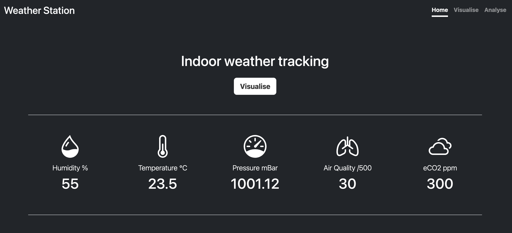

# weather-station
Home weather station with Raspberry Pi Pico &amp; Kitronik Air Quality Board




# Development

* To run the server go to the ```src``` directory and type:
```
flask --app server run --debug --host=0.0.0.0
```

* The ```rp2``` directory mirrors the scripts that will go onto the Raspberry Pi Pico. 

# Set up

## Poetry
To set up poetry environment:
```
poetry init
poetry shell
poetry install
```

## SQLite Database
From the `src` directory, initialise the SQLite database with:
```
flask --app server init-db
```
The database will appear in the `instance` directory as `weather.sqlite`

# Sensor Packages

## Raspberry Pi Pico W + Kitronik Air Quality Board

* Copy scripts from ```rp2``` onto Raspberry Pi. 
* Change constants at the top of the copy of ```send_data.py``` on the Pico:
```
SERVER_URL = 'localhost'+'/data'
WIFI_NAME = 'Wifi_name'
WIFI_PASSWORD = 'Wifi_password'
```

## Pico + SHT41

### Hardware

- [Pico W](https://thepihut.com/products/raspberry-pi-pico-w)
- [PiCowbell Proto](https://thepihut.com/products/adafruit-picowbell-proto-for-pico-reset-button-stemma-qt)
- [Adafruit Sensirion SHT41 Temperature & Humidity Sensor](https://thepihut.com/products/adafruit-sensirion-sht41-temperature-humidity-sensor-stemma-qt-qwiic) - [Datasheet](https://sensirion.com/media/documents/33FD6951/662A593A/HT_DS_Datasheet_SHT4x.pdf)

### Software

Setup the software by installing [jposada202020's MicroPython Driver for the SHT4X Sensors](https://micropython-sht4x.readthedocs.io/):

```sh
mpremote mip install github:jposada202020/MicroPython_SHT4X
```

Change constants at the top of `src/rp2_sht41/main.py` as required:

```
WIFI_NAME = "Wifi_name"
WIFI_PASSWORD = "Wifi_password"
SERVER = "http://localhost:5000"
UPDATE_PERIOD = 60  # seconds
```

Copy all the files from `src/rp2_sht41` onto the root of the Pico:

```sh
mpremote cp src/rp2_sht41/* :
```
