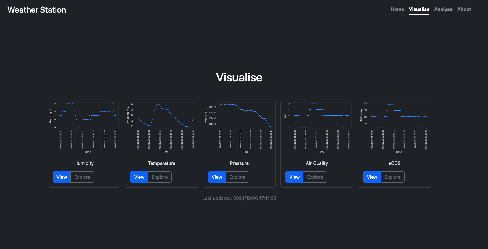

# weather-station
Home weather station with Raspberry Pi Pico &amp; Kitronik Air Quality Board


# Setup
In the orginal setup, the server is run from a Raspberry Pi, while development takes place on a laptop. They have slightly different needs for their environment setup and so are addressed separately here.  

Overview:
* [Environment setup on Mac/Linux computer](#environment-setup-on-maclinux-computer)
* [Environment setup on Raspberry Pi](#environment-setup-on-raspberry-pi)
* [SQLite Database](#sqlite-database)
* [Raspberry Pi Pico W + Kitronik Air Quality Board](#raspberry-pi-pico-w--kitronik-air-quality-board)
* [Development Server](#development-server)
* [Deploying to Production](#deploying-to-production)

Once it is set up and running, graphs will begin to generate on the Visualise page:




## Environment setup on Mac/Linux computer
### Pyenv
Use `pyenv` to change the python version for the project directory.* 
```
pyenv install 3.11.10
pyenv local 3.11
```
_\* Python 3.11 in this case to match the Raspberry Pi that will host the server for continuous data logging_

Ensure the following is in your `~/.zshrc`:
```
export PATH="/Users/username/.pyenv:$PATH"
eval "$(pyenv init -)"
```

### Poetry
To set up `poetry` environment:
```
poetry shell
poetry install
```

After this point, continue to [SQLite Database](#sqlite-database).

## Environment setup on Raspberry Pi
Raspberry Pi model 1B: Raspbian GNU/Linux 12 (bookworm)

### Dependencies
`Pillow` requires `zlib` and `libjpeg`. Install with:
```
sudo apt install libjpeg-dev zlib1g-dev
```

This project requires `numpy` to be installed with apt. See the section [Known issues with numpy](#known-issues-with-numpy) for more detail. 
```sh
sudo apt install python3-numpy
```

### Venv
`venv` is used instead of `poetry` on the Raspberry Pi. It is lighter weight and works well to lock down the version of `numpy` due to the problems listed below. 
A `requirements.txt` is generated with `poetry` from a Mac/Linux computer and then used by `venv` on the Raspberry Pi. See the [Development section](#to-update-the-environment) for more details on generating the `requirements.txt.`


`ssh` into the Raspberry Pi, and from the `weather-station` directory, run the following:
```sh
python -m venv --system-site-packages .venv
source .venv/bin/activate
pip install --prefer-binary -r requirements.txt 
```
*Note: `--prefer-binary` directs `pip` to use piwheels versions of packages if they are available. This saves time on compilation.* 

After this point, continue to [SQLite Database](#sqlite-database).


### Known issues with numpy
Some issues may be encountered with `numpy` throwing a `ChefInstallError` when running `poetry install` on a Raspberry Pi. 
If `numpy` appears to install correctly, it can be tested by opening Python and trying to import `numpy`. If it mentions the following error and fails to import then a system installation of `numpy` must be used: 
```
libf77blas.so.3: cannot open shared object file: No such file or directory
``` 

The solution is to make `numpy` available globally rather than installing it with `pip` in the `venv`.  
```sh
pip3 uninstall numpy  # remove previously installed version
sudo apt install python3-numpy
```
See https://numpy.org/devdocs/user/troubleshooting-importerror.html#raspberry-pi


## SQLite Database
From the `src` directory, initialise the SQLite database with:
```
flask --app server init-db
```
The database will appear in the `instance` directory as `weather.sqlite`

## Raspberry Pi Pico W + Kitronik Air Quality Board
* Copy scripts from ```rp2``` onto Raspberry Pi Pico. 
* Change constants at the top of the copy of ```main.py``` on the Pico:
```
SERVER_URL = 'localhost'+'/data'
WIFI_NAME = 'Wifi_name'
WIFI_PASSWORD = 'Wifi_password'
```

From this point see [Development Server](#development-server) or [Deploying to Production](#deploying-to-production) as required. 

## Development Server
* To run the server go to the ```src``` directory and execute:
```
flask --app server run --debug --host=0.0.0.0
```
If running the development server from the Raspberry Pi, remove the `--debug` option


## Deploying to Production
These instructions are written for a server that is run from a Raspberry Pi. 

### WSGI Server
Start [Gunicorn](https://gunicorn.org/) WSGI server from `src` directory using:
```sh
gunicorn -c server/gunicorn_config.py server:gunicorn_app
```

Set up the config `server/gunicorn_config.py`:
```sh
bind="127.0.0.1:8000"
workers=2
```

### HTTP Server
Install the [nginx](https://nginx.org/) HTTP server:
```sh
sudo apt-get install nginx
```

Set up a config at `/etc/nginx/sites-enabled/default`:
```
server {
    listen 80;
    listen [::]:80;
    server_name raspberrypi.local;
    access_log  /var/log/nginx/weather-station.log;

    location / {
        proxy_pass http://127.0.0.1:8000;
        proxy_set_header Host $host;
        proxy_set_header X-Forwarded-For $proxy_add_x_forwarded_for;
    }
  }
```
`Nginx` can be started with:
```sh
sudo systemctl start nginx
```
Changes made in the configuration file will not be applied until the command to reload configuration is sent to nginx or it is restarted. To reload configuration, execute:
```sh
sudo nginx -s reload
```

### Systemd: set up server to automatically run on startup
The last step is to automatically run the server on startup. 
This is done with the[`systemd`](https://systemd.io/) system and service manager, which is used by Raspberry Pi.   

For  Gunicorn we will need a new service that `systemd` can run. 
(Nginx has already created its own service on installation.)

Create a new file `weather-station.service` for `systemd` in the folder `/usr/lib/systemd/system`:

```sh
[Unit]
Description=Weather Station
After=multi-user.target

[Service]
WorkingDirectory=/home/{username}/Code/weather-station/src
ExecStart=/home/{username}/Code/weather-station/.venv/bin/gunicorn -c server/gunicorn_config.py server:gunicorn_app &

[Install]
WantedBy=multi-user.target
```
*\*Gunicorn is started with `&` so that it runs in the background.*

Finally, both Gunicorn and nginx must be started and enabled so that they can run automatically at startup of the Raspberry Pi:

```sh
sudo systemctl start nginx
sudo systemctl enable nginx

sudo systemctl start weather-station
sudo systemctl enable weather-station
```

(If needed the services can be stopped with `sudo systemctl stop {service}`.)


Setup is now complete!


# Development

## To update the environment:
1. Update the `pyproject.toml` as required 
2. Run `poetry install` to install new packages 
3. Run `poetry lock` to update lock file 
4. From within the `weather-station` dir, generate a `requirements.txt`:
```sh
poetry export --without-hashes --format=requirements.txt > requirements.txt
``` 
5. Copy over to the Raspberry Pi (via `scp` or `git`) and install using:
```sh
source .venv/bin/activate
pip install --prefer-binary -r requirements.txt 
```

## Development of Pico scripts
* The ```rp2``` directory mirrors the scripts that will go onto the Raspberry Pi Pico. 

# Appendix
* [Kitronik Air Quality Board](https://github.com/KitronikLtd/Kitronik-Pico-Smart-Air-Quality-Board-MicroPython)
* [BME68X Sensor API](https://github.com/boschsensortec/BME68x_SensorAPI)
* [Data sheet for BME688](https://www.bosch-sensortec.com/media/boschsensortec/downloads/datasheets/bst-bme688-ds000.pdf)
